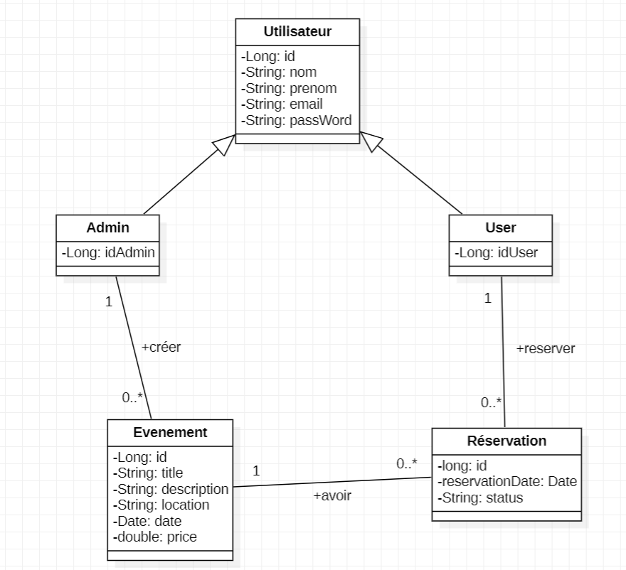
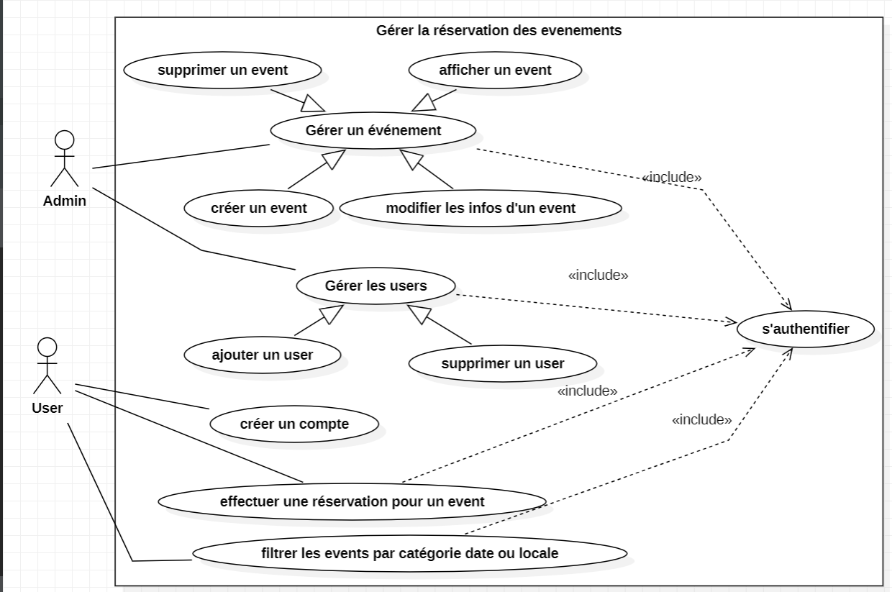
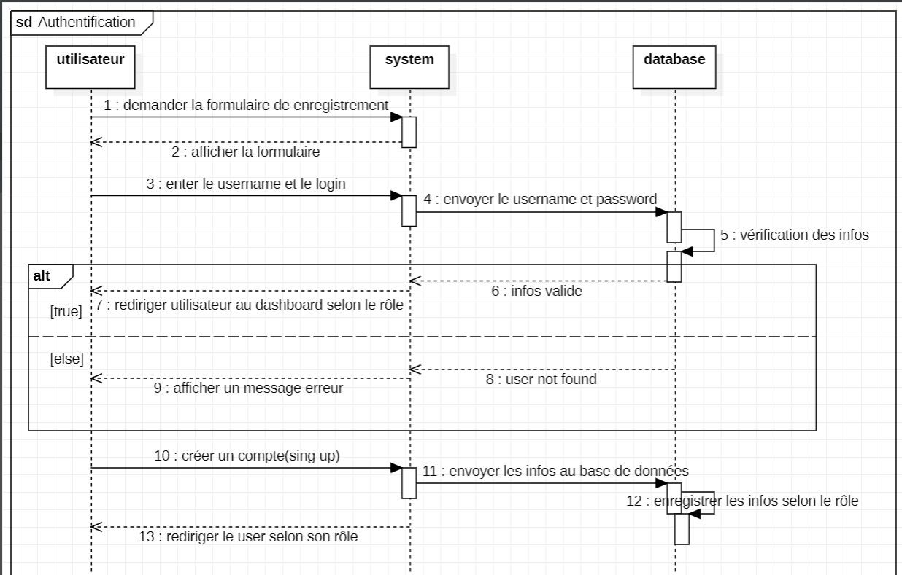

**Class Diagram:**

**Use case Diagram:**

**Sequence Diagram:**

**Lien pour ma collection dans postman**

https://hajar-9388784.postman.co/workspace/hajar's-Workspace~4bde9cbd-fa1c-4243-824b-a2e3d116a4ad/collection/44716308-b60834fc-51b0-400b-a88d-74460362bfe0?action=share&creator=44716308